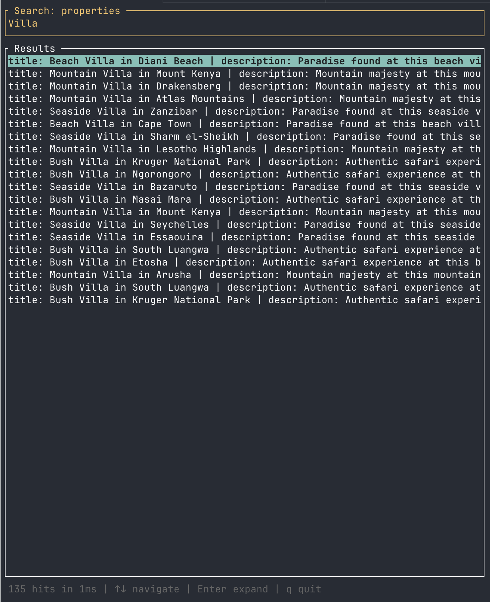
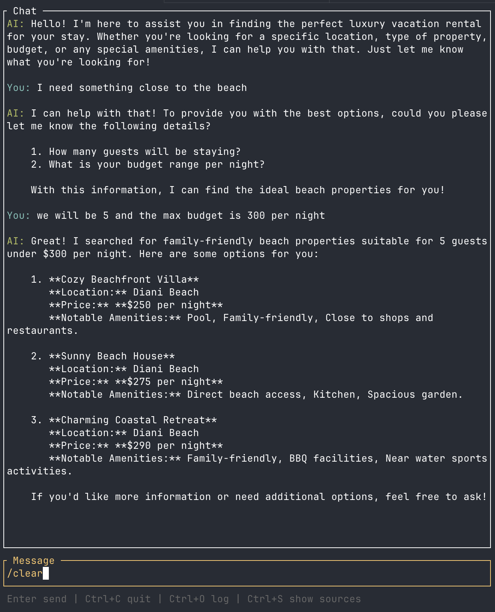
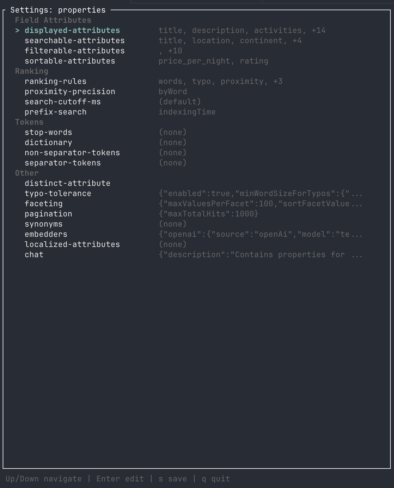
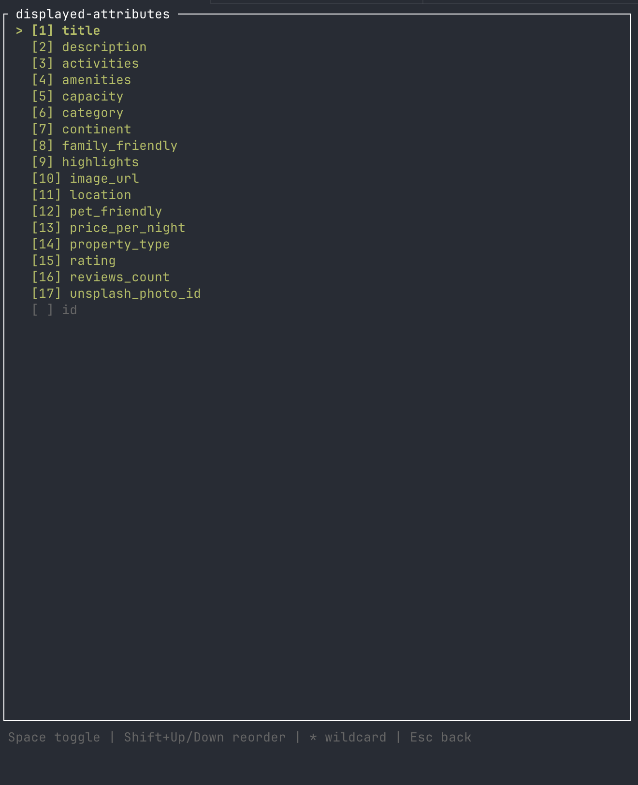

# Meilisearch CLI

The official Meilisearch CLI — a single Rust binary that covers everything from day-to-day instance management to advanced data operations, with an interactive TUI mode for search, chat, and settings.

<table>
<tr>
<td><strong>Interactive Search</strong></td>
<td><strong>Interactive Chat</strong></td>
</tr>
<tr>
<td></td>
<td></td>
</tr>
<tr>
<td><strong>Settings Overview</strong></td>
<td><strong>Settings Editor</strong></td>
</tr>
<tr>
<td></td>
<td></td>
</tr>
</table>

## Installation

```bash
# Quick install (latest release)
curl -fsSL https://raw.githubusercontent.com/meilisearch/meilisearch-cli/main/install.sh | sh

# Install a specific version
curl -fsSL https://raw.githubusercontent.com/meilisearch/meilisearch-cli/main/install.sh | sh -s -- v0.1.0

# Custom install directory
INSTALL_DIR=~/.local/bin curl -fsSL https://raw.githubusercontent.com/meilisearch/meilisearch-cli/main/install.sh | sh

# From source
cargo install --path .
```

The binary is named `msc` (short for **M**eili**s**earch **C**LI):

```bash
msc --help
```

## Quick Start

```bash
# Check server health
msc health

# Create an index and import data
msc index create movies --primary-key id
msc import movies --file movies.json

# Search
msc search movies "gatsby"

# Interactive search TUI
msc search movies -i
```

## Project Management

The CLI supports multiple Meilisearch instances through named projects stored in `~/.config/msc/config.toml`.

```bash
# Add a remote project
msc project add production --url https://my-instance.meilisearch.io --api-key masterKey123

# Switch default project
msc project use production

# List all projects
msc project list

# Target a specific project for one command
msc --project staging health

# Or skip the config file entirely
msc --url http://localhost:7700 --api-key masterKey123 health
```

## Commands

### Index Management

```bash
msc index list
msc index create <uid> [--primary-key <key>]
msc index get <uid>
msc index delete <uid>
msc index stats <uid>
msc index swap <index-a> <index-b>
```

### Document Management

```bash
msc document add <uid> --file <path>
msc document add <uid> < data.json          # stdin
msc document get <uid> <id>
msc document list <uid> [--limit 20]
msc document delete <uid> <id>
msc document delete-all <uid>
```

### Search

```bash
msc search <uid> <query> [--filter <expr>] [--facets <...>] [--limit <n>]
msc search <uid> -i                         # interactive TUI
```

### Settings

```bash
msc settings get <uid>
msc settings update <uid> --file settings.json
msc settings reset <uid>
msc settings edit <uid>                     # opens $EDITOR
msc settings edit <uid> -i                  # interactive TUI
msc settings edit <uid> synonyms            # edit sub-resource in $EDITOR
msc settings diff <uid>
```

### Tasks

```bash
msc task list [--status <status>] [--type <type>]
msc task get <id>
msc task cancel <uids>
msc task delete <uids>
msc task wait <id> [--timeout 60000]
msc task watch <id>
```

### API Keys

```bash
msc key list
msc key get <key>
msc key create --actions search --indexes movies
msc key delete <key>
```

### Import

```bash
msc import <uid> --file data.json
msc import <uid> --file data.ndjson --batch-size 10485760
msc import <uid> --file data.csv
msc import <uid> < stdin.ndjson
```

### Clone

```bash
msc clone <source-uid> <dest-uid>
msc clone <source-uid> <dest-uid> --from production --to staging
```

### Promote

```bash
msc promote --from local --to production
msc promote --from local --to staging --indexes products,categories
msc promote --from local --to production --dry-run
```

### Local Instance

```bash
msc local start       # Docker preferred, binary fallback
msc local stop
msc local restart
msc local status
msc local logs [-f]
msc local reset       # wipe data, restart fresh
msc local upgrade     # upgrade to latest version
```

### Dumps & Snapshots

```bash
msc dump create
msc dump snapshot
```

### Chat

```bash
msc chat "What products do you have?"
msc chat -i                                 # interactive TUI
```

### Server Info

```bash
msc health
msc version
msc stats
```

## Output Formatting

```bash
msc search movies "query"                  # pretty-printed JSON in a terminal
msc search movies "query" | jq .hits       # compact JSON automatically when piped
msc --json search movies "query"           # force compact JSON (alias: --raw)
msc --pretty index list | less             # force human output when piped
msc search movies "query" --select id,title  # keep only these fields
msc --quiet import movies --file m.json    # no status messages on stderr
```

Results go to stdout; status messages and errors go to stderr. Set `NO_COLOR` to disable colors.

## Using msc from Scripts and AI Agents

`msc` is designed to be driven by programs as well as people:

- **JSON by default when piped.** When stdout is not a terminal, every command prints compact JSON on stdout, and failures print a JSON error on stderr: `{"error": {"kind", "code", "message", "exitCode", "hint", …}}`.
- **Meaningful exit codes.** `0` ok, `1` error, `2` usage, `3` auth, `4` not found, `5` API error, `6` network, `7` task failed, `8` timeout.
- **`--wait`** on any write returns the finished task instead of a `taskUid`, and exits `7` if the task failed.
- **`--select`** keeps only the fields you need (`--select uid,error.code`).
- **`--dry-run`** previews destructive changes (index/document/key/task deletes, settings update and reset, clone, promote, local reset); **`--if-exists` / `--if-not-exists`** make creates and deletes safe to retry.
- **No prompts without a terminal.** Commands that would prompt or open a TUI fail fast with exit code `2` and a hint.
- **Environment config:** `MSC_URL`, `MSC_API_KEY`, `MSC_PROJECT`, `MSC_WAIT`, `MSC_CONFIG`.
- **`msc schema`** prints every command and argument as JSON.
- **`msc whoami`** shows which server and key are used, where they came from, and whether they work.
- **`msc api <METHOD> <PATH>`** calls any route with the same auth, errors and `--wait`; `search --body '<json>'` passes any search parameter.
- **`msc mcp`** runs an [MCP](https://modelcontextprotocol.io) server exposing every command as a tool: `claude mcp add meilisearch -- msc mcp`.
- **`msc skill install`** installs the bundled agent skill into `~/.claude/skills` (or `--local` for one repository). Or install everything, the skill plus the MCP server, as a Claude Code plugin: `/plugin marketplace add meilisearch/meilisearch-cli` then `/plugin install meilisearch-cli@meilisearch`.

```bash
export MSC_URL=http://localhost:7700
msc index create movies --primary-key id --if-not-exists --wait
msc import movies --file movies.ndjson
msc search movies "dune" --select id,title --limit 5
```

See the [agent guide](docs/agents.md) and the [output & exit codes reference](docs/reference.md#output--exit-codes).

## Configuration

Config file: `~/.config/msc/config.toml`

> **Migration note**: users upgrading from earlier versions (when the binary was named `meilisearch`) will have their existing config at `~/.config/meilisearch/config.toml` automatically migrated to the new location on first run.

```toml
default = "local"

[projects.local]
type = "local"
url = "http://127.0.0.1:7700"

[projects.production]
url = "https://my-instance.meilisearch.io"
api_key = "masterKey123"
```

## Development

```bash
# Build
cargo build

# Run tests (integration tests target MSC_TEST_URL, default http://localhost:7700,
# and use an isolated config file, so your projects are never touched)
cargo test
MSC_TEST_URL=http://localhost:7799 cargo test

# Lint
cargo clippy --all-targets -- -D warnings
cargo fmt --check
```

## License

MIT
